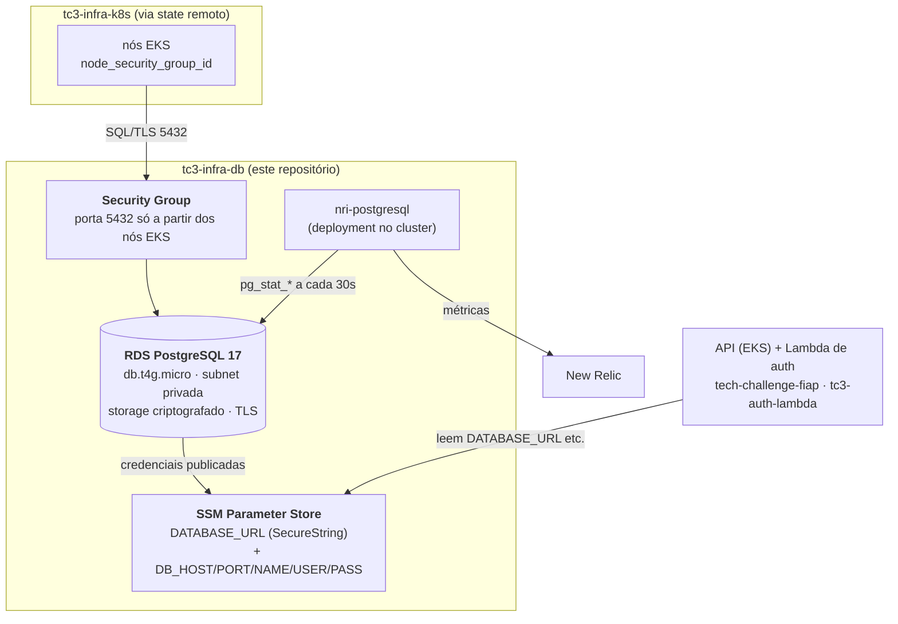

# tc3-infra-db

Infraestrutura do banco de dados gerenciado do Tech Challenge Fase 3 (FIAP SOAT) — sistema de gestão de oficina mecânica.

Provisiona o PostgreSQL no Amazon RDS e publica as credenciais no SSM Parameter Store, de onde a aplicação e a Lambda de autenticação as leem.

## O que este repositório cria

| Recurso | Detalhe |
|---|---|
| `aws_db_instance` | PostgreSQL 17 (minor escolhida pelo RDS), `db.t4g.micro`, storage criptografado |
| Subnet group | Subnets privadas da VPC criada em `tc3-infra-k8s` |
| Security group | Porta 5432 liberada apenas para os nós do EKS |
| Senha | Gerada pelo Terraform, nunca versionada |
| Parâmetros SSM | `DATABASE_URL` (SecureString) e dados de conexão avulsos |

## Tecnologias

Terraform ≥ 1.10 · AWS provider 5.x · Amazon RDS · SSM Parameter Store · GitHub Actions

## Dependência

Este repositório **depende de `tc3-infra-k8s`**: lê `vpc_id`, `private_subnet_ids` e `node_security_group_id` pelo state remoto. Aplique o cluster antes.

## Execução

```bash
cp terraform.tfvars.sample terraform.tfvars   # editar
terraform init -backend-config="bucket=SEU_BUCKET"
terraform apply
```

## Como a aplicação consome

O pipeline da aplicação lê o parâmetro e monta o Secret do Kubernetes:

```bash
aws ssm get-parameter \
  --name "/tc3-oficina/homolog/DATABASE_URL" \
  --with-decryption \
  --query Parameter.Value --output text
```

As migrations do Prisma continuam sendo aplicadas pelo Job do Kubernetes já existente no repositório da aplicação — ele passa a apontar para o endpoint do RDS.

## CI/CD

`.github/workflows/terraform.yml`

- **Pull request** → `fmt`, `validate` e `plan` comentado no PR
- **Push em `develop`** → apply em homologação
- **Push em `main`** → apply em produção

Secrets necessários: `AWS_ROLE_ARN` e `TF_STATE_BUCKET` (ambos vindos do bootstrap em `tc3-infra-k8s`).

## Monitoria

O banco é monitorado por um agente que roda **dentro do cluster** e consulta o
RDS direto — `newrelic-postgres.tf`. Não há CloudWatch no caminho: as métricas
saem de `pg_stat_database` e `pg_stat_bgwriter`, que são as mesmas visões que a
AWS lê para montar o namespace `AWS/RDS`.

| Recurso | Detalhe |
|---|---|
| Usuário `newrelic_monitor` | Role `pg_monitor`: lê as visões de estatística, nenhuma tabela de negócio |
| Job de bootstrap | Cria o usuário de dentro da VPC, que é de onde o RDS é alcançável |
| Deployment `nri-postgresql` | Raspa o banco a cada 30s e envia direto para o New Relic, com as tags `environment`/`project` em toda amostra |
| Sondas do agente | startup, liveness e readiness em `exec` (o servidor de status do agente só escuta em localhost); readiness falha com credencial recusada |

No PostgreSQL 17 (a versão travada aqui), checkpoints saem como
`checkpointer.*` e escrita por backend como `io.*` — os nomes `bgwriter.*`
antigos dessas medidas deixam de existir.

Depende de `tc3-infra-k8s` já ter sido aplicado: é de lá que vêm o namespace
`newrelic` e a license key no SSM. Este repositório não recebe a chave por
variável: o `.env` da raiz (ignorado pelo git) existe só para testes locais.

O detalhamento está em
[`tc3-infra-k8s/OBSERVABILIDADE.md`](../tc3-infra-k8s/OBSERVABILIDADE.md).

## Modelagem de dados

O **modelo relacional**, o **diagrama ER** e a **justificativa formal** da escolha do PostgreSQL vivem no repositório da aplicação, onde o schema é mantido:

- [**RFC-003 — Escolha do banco e ajustes no modelo relacional**](https://github.com/LucasValada/tech-challenge-fiap/blob/develop/docs/rfc/RFC-003-escolha-do-banco.md)
- Seção [**Modelo de dados (Diagrama ER)**](https://github.com/LucasValada/tech-challenge-fiap#modelo-de-dados-diagrama-er) do README do [`tech-challenge-fiap`](https://github.com/LucasValada/tech-challenge-fiap)
- Schema canônico: `prisma/schema.prisma` (aplicação)

Ajustes da modelagem já aplicados na Fase 3 (o "melhorar" que a fase pede): campo `status` em `Cliente` (a Lambda de autenticação valida não só a existência do CPF, mas se o cliente está **ATIVO**), snapshots imutáveis nas linhas da OS, numeração sequencial anual e políticas de exclusão explícitas — detalhados na RFC-003.

## Arquitetura



A VPC, as subnets privadas e o security group dos nós vêm de [`tc3-infra-k8s`](https://github.com/tiagostorch/tc3-infra-k8s) pelo state remoto. As credenciais publicadas no SSM são consumidas pela aplicação ([`tech-challenge-fiap`](https://github.com/LucasValada/tech-challenge-fiap)) e pela Lambda de autenticação ([`tc3-auth-lambda`](https://github.com/tiagostorch/tc3-auth-lambda)).
